Walkthrough of COVID-19 cell-cell communication analysis with
InterCellar
================
Marta Interlandi (<marta.interlandi@uni-muenster.de>)

## Introduction

In this walkthrough, we show how the results presented in our paper were
collected, with regards to the COVID-19 datasets from [Chua et
al.](https://www.nature.com/articles/s41587-020-0602-4). All results
were generated by [InterCellar
v2.0.0](http://www.bioconductor.org/packages/release/bioc/html/InterCellar.html)
(Bioconductor release 3.14).

## Input data

We used [CellPhoneDB](https://www.cellphonedb.org/) (CPDB) to compute
predicted cell-cell interactions (CCI). As this study considered three
different conditions (COVID-19 critical, COVID-19 moderate and healthy
controls), we run CPDB separately for each condition. You can find these
CPDB-CCI data in folder `input_data/covid19/cpdb_output/`. For details
on how we preprocessed the scRNA-seq data, please check out folder
`input_data/covid19/`.

## Upload data

Once `InterCellar` is running, we navigate to the **Upload** module
under **1.Data** to upload our input data and start the analysis. We use
panel *From supported tools*, where we can select `CellPhoneDB v2` as
input method and, after filling out metadata which will be then used by
`InterCellar` (output folder, CCI data ID and output folder tag), we
select the respective folders for COVID-19 critical and moderate
conditions and upload the data by clicking on `GO!`. As we start by
investigating these two conditions, we can upload both and analyze them
in parallel before actually comparing
them.

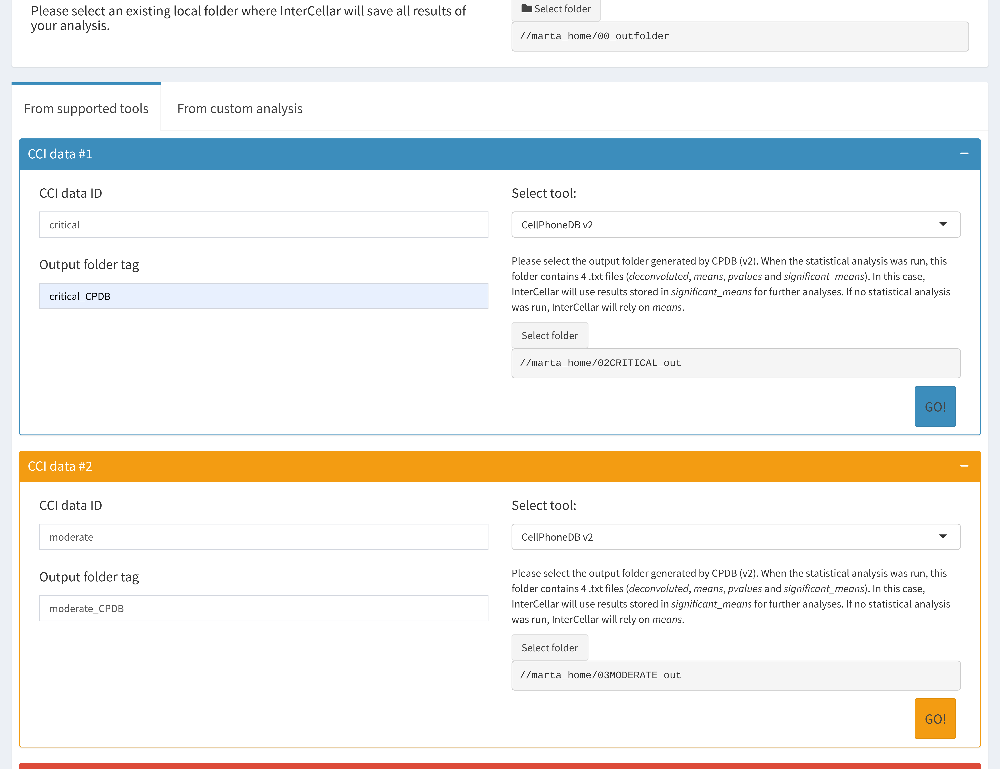

## Functional annotation: function-verse

Since the main focus of our analysis is a direct comparison between the
two disease conditions, we can skip the exploration of **cluster-verse**
and **gene-verse** and directly proceed with the functional annotation
available in the **function-verse**. We can then perform the annotation
of each condition by switching the *Active CCI data* on the left menu.
The functional annotation is a required step before proceeding with the
**Data-driven analysis**. The annotation result for the critical cases
is shown in the **Table**
below:

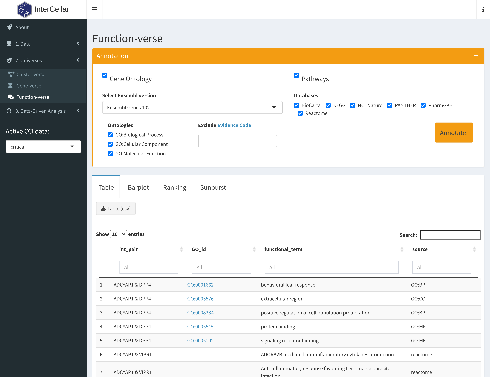

## Multiple conditions: comparison

We can now navigate to the **Multiple Conditions** panel, under **3.
Data-driven analysis**. Here we select the two conditions we want to
compare: critical VS moderate cases. The first section shows the result
of a *Cluster-based* comparison: a **Back-to-back Barplot** displays the
differences in number of interactions per cluster, in the two
conditions.

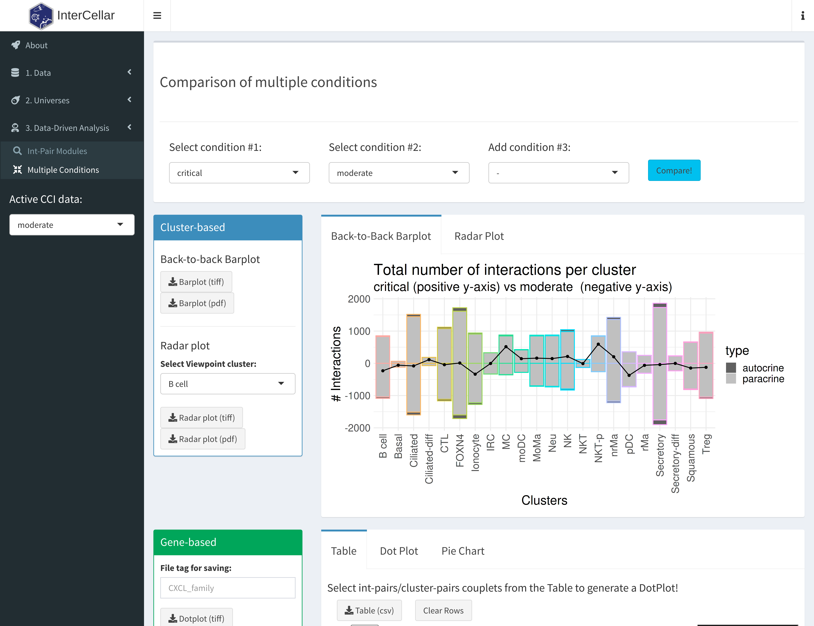

When switching to the tab **Radar Plot**, we can compare the relative
number of interactions from a selected viewpoint cluster, in this case
*MoMa*:

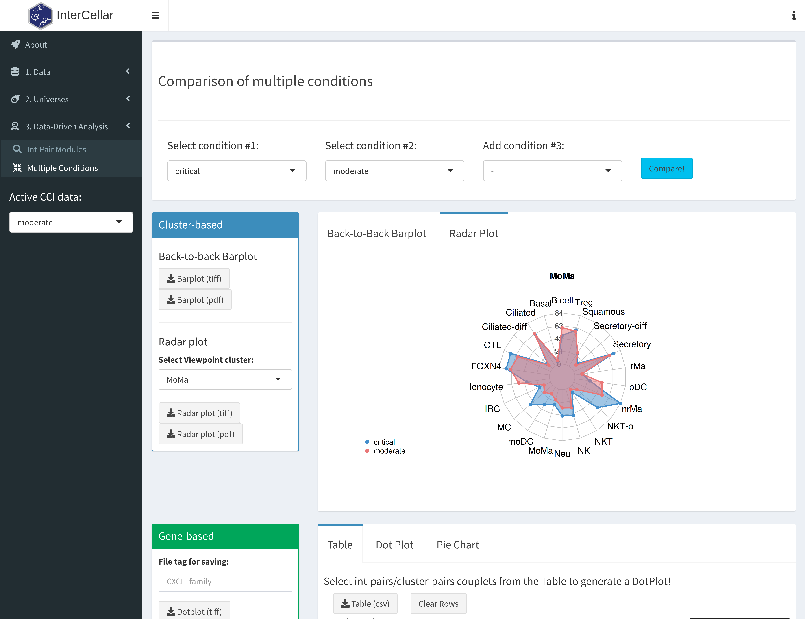

Next, we are interested in analyzing which int-pairs are
condition-specific and which annotated functional terms are significant
in this comparison. Scrolling down to the *Function-based* section, we
can investigate condition-specific int-pairs and their significant
functions, shown in the following
**Table**:

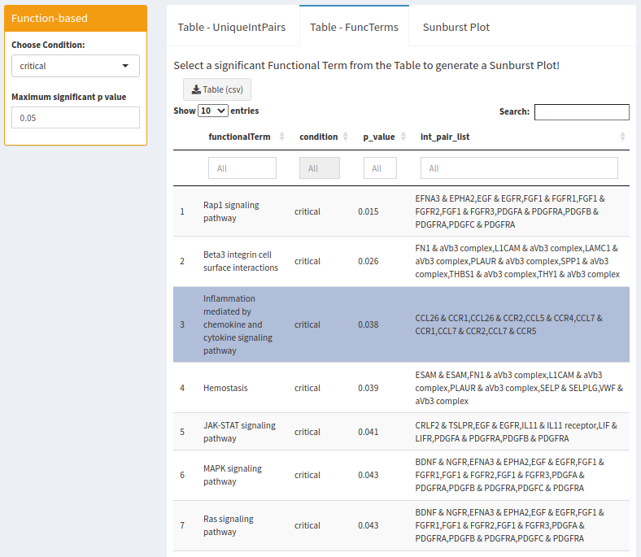

By clicking on a functional term of interest, a **Sunburst Plot** is
generated:

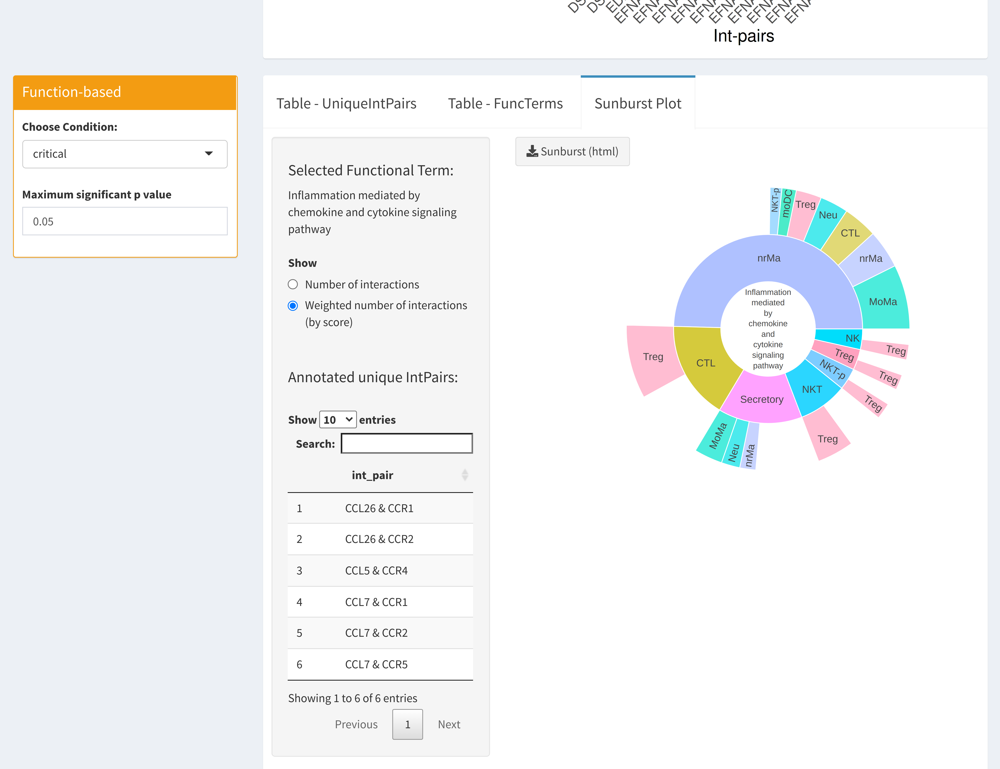

## Adding healthy controls as third condition

Lastly, we add the control data to investigate int-pair/cluster-pair
couplets. Going back to the **Upload**
module:

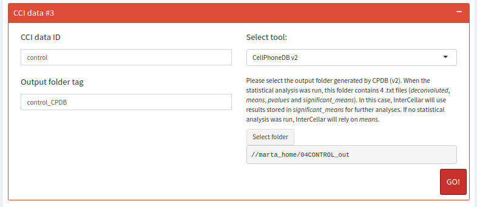

Once again, we can perform a parallel analysis of the 3 conditions, by
switching the *Active CCI Data*. Here, we use the functionalities
implemented in the **gene-verse** to investigate int-pairs of the
*CXC*-family. For example, we select the int-pairs of interest in the
**Table** below, for moderate
cases:

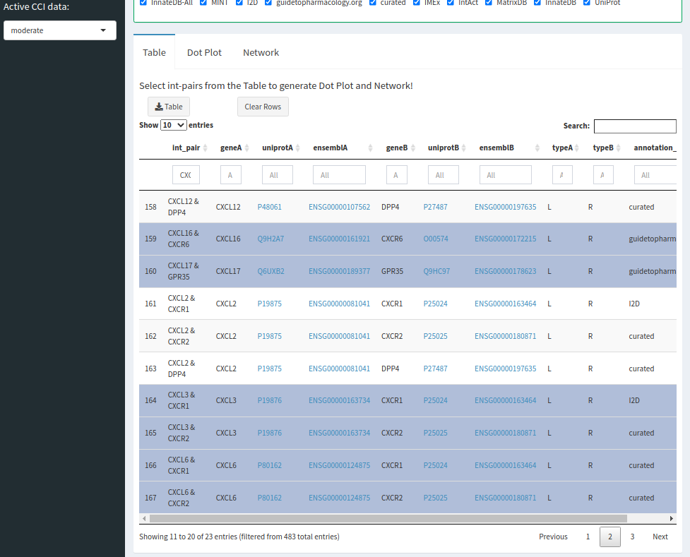

and we refine the cluster selection in the **Dot
Plot**:

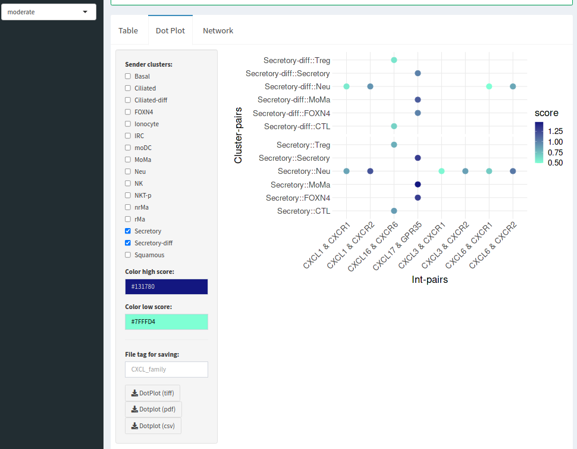

Finally, we perform the functional annotation for the newly-added
control data and move to the **Multiple Conditions** comparison to
analyze condition-specific int-pair/clust-pair couplets. Thus, we add
controls as third condition in the
comparison:

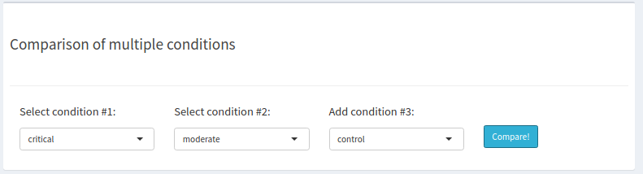

And select condition-specific int-pairs from the *Gene-based* comparison
**Table**, to see them in a **Dot
Plot**:

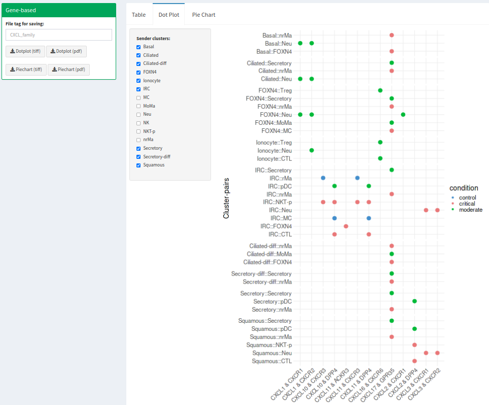
