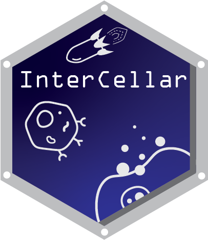

Introduction
============

`InterCellar` is a [Bioconductor](http://bioconductor.org) package that
provides an interactive Shiny application to enable the analysis of
cell-cell communication from single-cell RNA sequencing (scRNA-seq)
data. Every step of the analysis can be performed interactively, thus
not requiring any programming skills. Moreover, `InterCellar` runs on
your local machine, avoiding issues related to data privacy.

Installation
------------

`InterCellar` is distributed as a
[Bioconductor](https://www.bioconductor.org/) package and requires R
(version 4.1) and Bioconductor (version 3.14).

To install `InterCellar` package enter:

``` r
if (!requireNamespace("BiocManager", quietly = TRUE))
    install.packages("BiocManager")

BiocManager::install("InterCellar")
```

Launching the app
-----------------

Once InterCellar is successfully installed, it can be loaded as follow:

In order to start the app, please run the following command:

``` r
InterCellar::run_app( reproducible = TRUE )
```

`InterCellar` should be opening in a browser. If this does not happen
automatically, please open a browser and navigate to the address shown
(for example, `Listening on http://127.0.0.1:6134`). The flag
`reproducible = TRUE` ensures that your results will be reproducible
across R sessions.

Data upload
===========


Data exploration: Universes
===========================

References
==========
